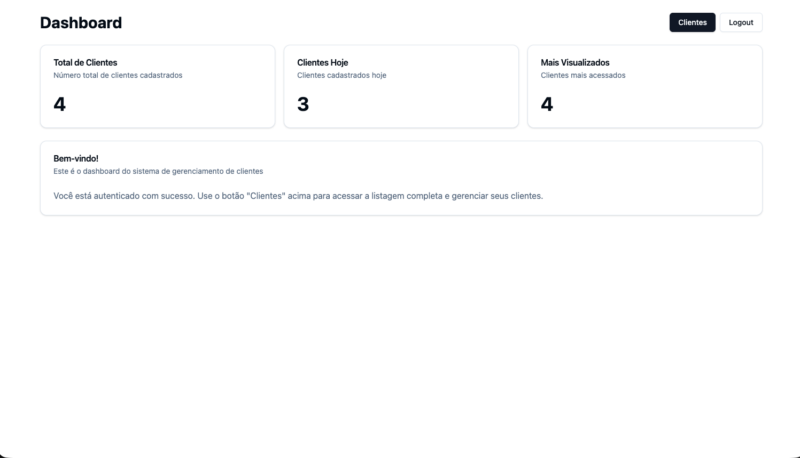
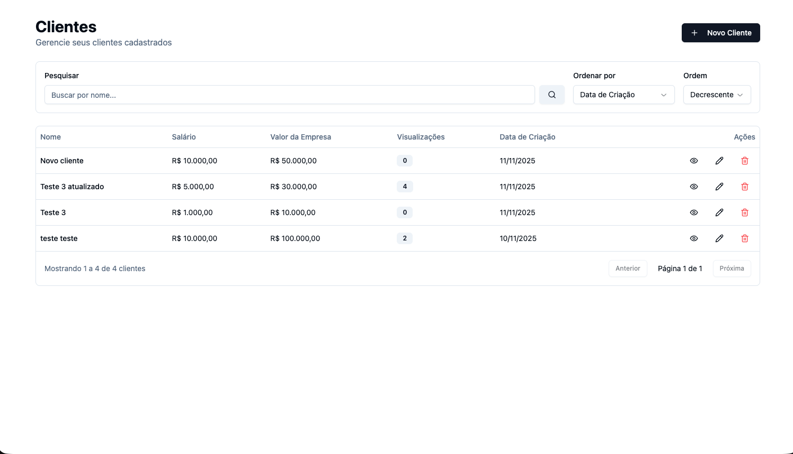
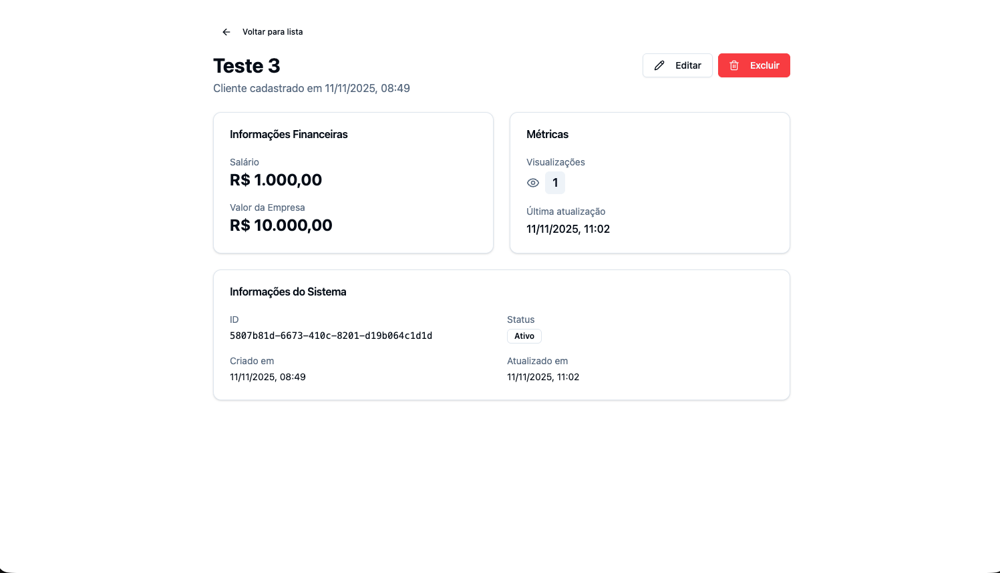
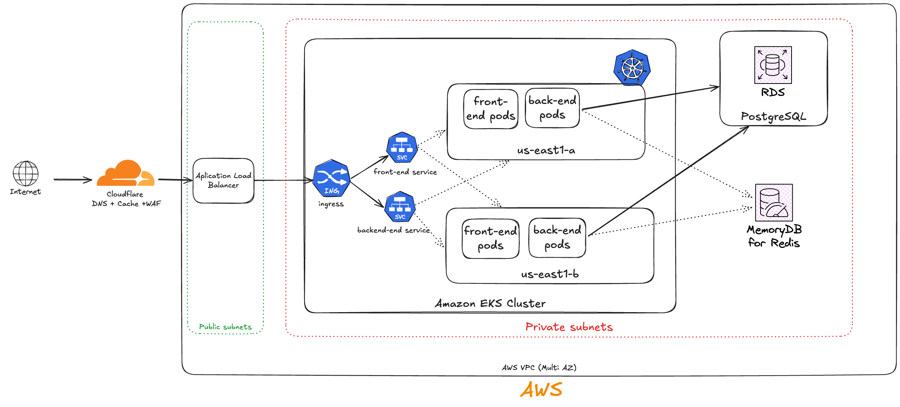
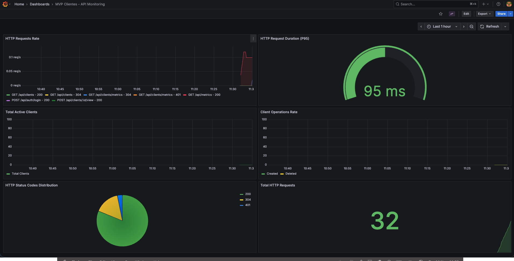

# MVP Clientes - Sistema de Gerenciamento de Clientes


Sistema completo de gerenciamento de clientes desenvolvido como MVP (Minimum Viable Product) utilizando arquitetura monorepo com Nx, stack moderna TypeScript full-stack, e práticas de DevOps.

Desenvolvido conforme requisitos em [REQUIREMENTS.md](REQUIREMENTS.md)

## 📑 Índice

- [Visão Geral](#-visão-geral)
- [Arquitetura](#-arquitetura)
- [Tecnologias](#-tecnologias)
- [Estrutura do Projeto](#-estrutura-do-projeto)
- [Pré-requisitos](#-pré-requisitos)
- [Instalação](#-instalação)
- [Execução](#-execução)
  - [Desenvolvimento Local](#desenvolvimento-local)
  - [Docker](#docker)
- [API Documentation](#-api-documentation)
- [Testes](#-testes)
- [CI/CD](#-cicd)
- [Observabilidade](#-observabilidade)
- [Segurança](#-segurança)
- [Contribuindo](#-contribuindo)

## 🎯 Visão Geral

O **MVP Clientes** é uma aplicação web moderna para gerenciamento de clientes com recursos completos de CRUD, autenticação JWT, auditoria de operações, métricas de observabilidade e dashboard administrativo.

### Funcionalidades Principais

- **Autenticação e Autorização**: Sistema JWT com proteção de rotas
- **Gerenciamento de Clientes**: CRUD completo com soft delete
- **Dashboard Administrativo**: Métricas e estatísticas em tempo real
- **Auditoria Completa**: Log de todas operações (CREATE, READ, UPDATE, DELETE)
- **Observabilidade**: Logs estruturados (Pino) e métricas Prometheus
- **Health Checks**: Monitoramento de saúde da aplicação e banco de dados
- **Documentação API**: Swagger/OpenAPI integrado
- **CI/CD**: Pipelines automatizados com GitHub Actions
- **Containerização**: Docker e Docker Compose para desenvolvimento e produção

### Casos de Uso

1. **Cadastro de Clientes**: Registro completo com validação de CPF, email e telefone
2. **Consulta e Busca**: Listagem paginada com filtros e ordenação
3. **Rastreamento de Visualizações**: Contador automático de acessos aos detalhes do cliente
4. **Auditoria**: Histórico completo de operações para compliance
5. **Métricas**: Monitoramento de performance e uso da aplicação

## 🏞️ Screenshots

Dashboard:


Clientes:

Visualizar cliente:


## 🏗️ Arquitetura

### Arquitetura de Cloud - AWS

Como proposta de arquitetura de implantação na AWS propõe-se abaixo o modelo de implantação, utilizando EKS para orquestração das aplicações, escalabilidade e alta disponibilidade.



Elementos principais:

- Cloudflare: Ponto principal de entrada para DNS, WAF e CDN podendo também ser substituído pelo Route 53, Cloudfront + AWS WAF. A escolha foi devido a facilidade de configuração e custo-benefício.
- Aplication Load Balancer (ALB): Balanceador de carga gerenciado da AWS para distribuir as requisições com o Ingress Controller que irá distribuir as requisições para o Cluster.
- Dentro do EKS todas requisições de serão distribuidas para o serviço respectivo (back-end ou front-end) e os pods distribuidos em nós com diferentes zonas da região para alta disponibilidade (no exemplo us-east1-a e us-east1-b). Diferentes regiões podem ser adicionadas também.
- HPA será responsável por monitorar as métricas de uso dos pods e escalar o número de réplicas sempre que disponível balanceando entre os nós.
- Todos outros recursos do projeto ficam na VPC interna como RDS para o DB e MemoryDB para Redis restringindo a acessos autorizados.
- Prometheus, Grafana e outros recursos podem ser instalados da mesma forma em um node pool específico (MANAGEMENT) restringindo acessos.

### Visão Geral da Arquitetura da Aplicação

```
┌─────────────────────────────────────────────────────────────────┐
│                         MONOREPO (Nx)                           │
├─────────────────────────────────────────────────────────────────┤
│                                                                 │
│  ┌──────────────────────┐         ┌──────────────────────┐     │
│  │   FRONT-END          │         │     BACK-END         │     │
│  │  (React 19 + Vite)   │◄────────┤   (NestJS 11)        │     │
│  │                      │  REST   │                      │     │
│  │  • React Router      │  API    │  • TypeORM           │     │
│  │  • React Hook Form   │         │  • JWT Auth          │     │
│  │  • Zustand           │         │  • Swagger           │     │
│  │  • Tailwind CSS      │         │  • Pino Logger       │     │
│  │  • Radix UI          │         │  • Prometheus        │     │
│  │  • Axios             │         │  • Passport.js       │     │
│  └──────────────────────┘         └──────────┬───────────┘     │
│           │                                   │                 │
│           │                                   │                 │
│           │                                   ▼                 │
│           │                        ┌──────────────────────┐     │
│           │                        │   PostgreSQL 16      │     │
│           │                        │                      │     │
│           │                        │  • clients           │     │
│           │                        │  • users             │     │
│           │                        │  • audits            │     │
│           │                        └──────────────────────┘     │
│           │                                                     │
│           ▼                                                     │
│  ┌──────────────────────────────────────────────────────────┐  │
│  │            OBSERVABILITY & MONITORING                    │  │
│  │  • Prometheus Metrics (/api/metrics)                     │  │
│  │  • Health Checks (/api/healthz)                          │  │
│  │  • Structured Logs (Pino JSON)                           │  │
│  │  • Audit Trail (Database)                                │  │
│  └──────────────────────────────────────────────────────────┘  │
│                                                                 │
└─────────────────────────────────────────────────────────────────┘
```

### Fluxo de Dados
Ilustração de como os componentes se comunicam
```
┌─────────┐       ┌──────────┐       ┌────────────┐       ┌──────────┐
│         │       │          │       │            │       │          │
│ Browser │──────►│ React UI │──────►│ NestJS API │──────►│ Database │
│         │       │          │       │            │       │          │
└─────────┘       └──────────┘       └────────────┘       └──────────┘
     ▲                  │                   │                    │
     │                  │                   │                    │
     └──────────────────┘                   │                    │
           Response                         │                    │
                                            ▼                    ▼
                                     ┌────────────┐      ┌──────────┐
                                     │   Audit    │      │  Metrics │
                                     │   Logger   │      │ Service  │
                                     └────────────┘      └──────────┘
```

### Módulos do Back-End

```
AppModule (Root)
├── ConfigModule (Configurações globais)
├── DatabaseModule (TypeORM)
│   └── Entities: User, Client, Audit
├── AuthModule (Autenticação JWT)
│   ├── AuthService
│   ├── AuthController
│   ├── JwtStrategy
│   └── JwtAuthGuard
├── ClientsModule (Gerenciamento de Clientes)
│   ├── ClientsService
│   ├── ClientsController
│   └── ClientsRepository
├── AuditsModule (Auditoria)
│   ├── AuditsService
│   ├── AuditsController
│   └── AuditInterceptor
├── MetricsModule (Métricas Prometheus)
│   ├── MetricsService
│   └── MetricsController
└── HealthModule (Health Checks)
    └── HealthController
```

### Features do Front-End

```
App (Router)
├── Public Routes
│   └── /login → LoginPage
└── Protected Routes (JWT Guard)
    ├── /dashboard → DashboardPage
    │   ├── Métricas de clientes
    │   ├── Gráficos de crescimento
    │   └── Últimos cadastros
    ├── /clients → ClientsListPage
    │   ├── Tabela paginada
    │   ├── Busca e filtros
    │   └── Ações CRUD
    └── /clients/:id → ClientDetailPage
        ├── Detalhes completos
        └── Contador de visualizações
```

## 🚀 Tecnologias

### Back-End

| Tecnologia | Versão | Descrição |
|------------|--------|-----------|
| **NestJS** | 11.0.0 | Framework Node.js progressivo |
| **TypeORM** | 0.3.27 | ORM para TypeScript e JavaScript |
| **PostgreSQL** | 16 | Banco de dados relacional |
| **Passport.js** | 10.0.4 | Middleware de autenticação |
| **JWT** | 10.2.0 | JSON Web Tokens |
| **Pino** | 9.6.0 | Logger de alta performance |
| **Prometheus** | 15.1.3 | Métricas e monitoramento |
| **Swagger** | 8.0.11 | Documentação OpenAPI |
| **Bcrypt** | 5.1.1 | Hash de senhas |
| **Jest** | 29.7.0 | Framework de testes |

### Front-End

| Tecnologia | Versão | Descrição |
|------------|--------|-----------|
| **React** | 19.0.0 | Biblioteca UI |
| **Vite** | 7.0.0 | Build tool e dev server |
| **TypeScript** | 5.9.3 | Superset tipado do JavaScript |
| **React Router** | 6.29.0 | Roteamento SPA |
| **React Hook Form** | 7.66.0 | Gerenciamento de formulários |
| **Zod** | 4.1.12 | Validação de schemas |
| **Zustand** | 5.0.8 | Gerenciamento de estado |
| **Axios** | 1.6.0 | Cliente HTTP |
| **Tailwind CSS** | 3.4.3 | Framework CSS utility-first |
| **Radix UI** | - | Componentes acessíveis |
| **Sonner** | 1.7.3 | Toast notifications |
| **Vitest** | 3.0.5 | Framework de testes |

### DevOps & Infraestrutura

| Tecnologia | Descrição |
|------------|-----------|
| **Nx** | Monorepo build system |
| **Docker** | Containerização |
| **Docker Compose** | Orquestração de containers |
| **GitHub Actions** | CI/CD pipelines |
| **ESLint** | Linting de código |
| **Prettier** | Formatação de código |

## 📂 Estrutura do Projeto

```
mvp-clientes/
├── .github/
│   └── workflows/
│       ├── backend.yml          # Pipeline CI/CD do back-end
│       └── frontend.yml         # Pipeline CI/CD do front-end
├── back-end/                    # Aplicação NestJS
│   ├── src/
│   │   ├── app/
│   │   │   ├── auth/           # Módulo de autenticação
│   │   │   ├── clients/        # Módulo de clientes
│   │   │   ├── audits/         # Módulo de auditoria
│   │   │   ├── metrics/        # Módulo de métricas
│   │   │   ├── health/         # Módulo de health check
│   │   │   ├── database/       # Configuração do banco
│   │   │   ├── entities/       # Entidades TypeORM
│   │   │   └── common/         # Utilitários compartilhados
│   │   ├── config/             # Configurações da aplicação
│   │   ├── migrations/         # Migrations do TypeORM
│   │   └── main.ts             # Entry point
│   ├── test/                   # Testes E2E
│   ├── docker-compose.yml      # Compose do back-end + DB
│   ├── Dockerfile              # Imagem Docker do back-end
│   └── project.json            # Configuração Nx
├── front-end/                  # Aplicação React
│   ├── src/
│   │   ├── app/                # Rotas e configuração
│   │   ├── features/
│   │   │   ├── auth/          # Feature de autenticação
│   │   │   ├── clients/       # Feature de clientes
│   │   │   └── dashboard/     # Feature de dashboard
│   │   ├── shared/            # Código compartilhado
│   │   │   ├── components/    # Componentes reutilizáveis
│   │   │   ├── services/      # Serviços API
│   │   │   ├── store/         # Estado global (Zustand)
│   │   │   ├── types/         # Tipos TypeScript
│   │   │   └── utils/         # Utilitários
│   │   └── assets/            # Recursos estáticos
│   ├── public/                # Arquivos públicos
│   ├── docker-compose.yml     # Compose do front-end
│   ├── Dockerfile             # Imagem Docker do front-end
│   └── project.json           # Configuração Nx
├── docs/                      # Documentação adicional
├── nx.json                    # Configuração do Nx
├── package.json               # Dependências do workspace
├── tsconfig.base.json         # TypeScript config base
├── CLAUDE.md                  # Contexto técnico do projeto
├── REQUIREMENTS.md            # Requisitos detalhados do MVP
└── README.md                  # Este arquivo
```

## 📋 Pré-requisitos

Antes de iniciar, certifique-se de ter instalado:

- **Node.js**: v20.x ou superior
- **npm**: v10.x ou superior
- **Docker**: v24.x ou superior
- **Docker Compose**: v2.x ou superior
- **Git**: v2.x ou superior

### Verificar Instalação

```bash
node --version    # deve retornar v20.x ou superior
npm --version     # deve retornar v10.x ou superior
docker --version  # deve retornar 24.x ou superior
docker compose version  # deve retornar v2.x ou superior
git --version     # deve retornar 2.x ou superior
```

## 🔧 Instalação

### 1. Clone o Repositório

```bash
git clone https://github.com/seu-usuario/mvp-clientes.git
cd mvp-clientes
```

### 2. Instale as Dependências

```bash
npm install
```

Este comando instalará todas as dependências do monorepo, incluindo:
- Dependências do back-end
- Dependências do front-end
- Ferramentas de build e desenvolvimento (Nx, ESLint, Prettier, etc.)

### 3. Configure as Variáveis de Ambiente

#### Back-End

```bash
cd back-end
cp .env.example .env
```

Edite o arquivo `.env` com suas configurações:

```env
# Ambiente
NODE_ENV=development

# Servidor
PORT=3000

# Database
DATABASE_HOST=localhost
DATABASE_PORT=5432
DATABASE_NAME=mvp_clientes
DATABASE_USER=postgres
DATABASE_PASSWORD=postgres

# JWT
JWT_SECRET=your-secret-key-change-in-production
JWT_EXPIRES_IN=24h

# Logs
LOG_LEVEL=info
```

#### Front-End

```bash
cd ../front-end
cp .env.example .env
```

Edite o arquivo `.env`:

```env
# Ambiente
NODE_ENV=development
PORT=4200

# API
VITE_API_URL=http://localhost:3000

# Logs
VITE_LOG_LEVEL=info
VITE_ENABLE_MOCK_API=false
```

## 🚀 Execução

### Desenvolvimento Local

#### Opção 1: Executar Tudo com Nx

Na raiz do projeto:

```bash
# Inicia o back-end (API + PostgreSQL via Docker Compose)
nx serve back-end

# Em outro terminal, inicia o front-end
nx serve front-end
```

#### Opção 2: Executar Individualmente

**Back-End:**

```bash
cd back-end

# Inicia o PostgreSQL via Docker Compose
docker compose up -d db

# Execute as migrations
npx nx run back-end:migration:run

# Inicie o servidor de desenvolvimento
npx nx serve back-end
```

O back-end estará disponível em:
- API: http://localhost:3000
- Swagger Docs: http://localhost:3000/docs
- Health Check: http://localhost:3000/api/healthz
- Metrics: http://localhost:3000/api/metrics

**Front-End:**

```bash
cd front-end

# Inicie o servidor de desenvolvimento
nx serve front-end
```

O front-end estará disponível em http://localhost:4200

### Docker

A forma mais simples de executar a aplicação completa é usando Docker Compose.

#### 1. Executar Back-End + PostgreSQL

```bash
cd back-end
docker compose up -d
```

Este comando irá:
1. Criar uma rede Docker `mvp-network`
2. Iniciar um container PostgreSQL 16 Alpine
   - Porta: 5432
   - Database: `mvp_clientes`
   - Healthcheck: A cada 5 segundos
3. Construir a imagem Docker do back-end
4. Iniciar o container do back-end (aguarda DB estar saudável)
   - Porta: 3000
   - Modo de desenvolvimento com hot-reload
   - Volumes montados para alterações em tempo real

#### 2. Executar Front-End

```bash
cd front-end
docker compose up -d
```

Este comando irá:
1. Construir a imagem Docker do front-end
2. Iniciar o container Vite em modo desenvolvimento
   - Porta: 4200
   - Volumes montados para hot-reload

#### 3. Executar Migrations no Container

```bash
cd back-end

# Executar migrations
docker compose exec back-end npx nx run back-end:migration:run

# Reverter última migration
docker compose exec back-end npx nx run back-end:migration:revert

# O seed é executado automaticamente ao iniciar o back-end em modo desenvolvimento
# Basta executar o servidor e o usuário admin será criado automaticamente.
```

### Credenciais de Acesso

O seed é executado automaticamente quando você inicia o back-end em modo desenvolvimento (`NODE_ENV=development`). O `SeedService` cria automaticamente um usuário administrador.

Use as seguintes credenciais para login:

- **Email**: `admin@example.com`
- **Senha**: `password123`

> **Nota de Segurança**: Altere as credenciais padrão em produção!

## 📚 API Documentation

### Swagger/OpenAPI

A documentação interativa da API está disponível em:

**URL**: http://localhost:3000/docs

## 🧪 Testes

### Back-End (Jest)

```bash
# Executar todos os testes
npx nx test back-end

# Executar testes com coverage
npx nx test back-end --coverage

# Executar testes em watch mode
npx nx test back-end --watch

# Executar teste específico
npx nx test back-end --testFile=clients.service.spec.ts
```

## 🔄 CI/CD

O projeto utiliza **GitHub Actions** para automação de CI/CD com pipelines independentes para back-end e front-end.

### Configuração dos Pipelines

**Arquivos**:
- [.github/workflows/backend.yml](.github/workflows/backend.yml)
- [.github/workflows/frontend.yml](.github/workflows/frontend.yml)

#### Triggers
- Push ou Pull Request nas branches `main` ou `develop`
- Execução apenas quando há alterações no respectivo diretório (`back-end/**` ou `front-end/**`)

#### Etapas do Pipeline

1. Checkout do código
2. Setup do Node.js 20.x com cache npm
3. Instalação de dependências (`npm ci`)
4. Verificação de formatação (Prettier)
5. Lint (ESLint)
6. Testes unitários com cobertura
7. Build de produção
8. Upload de artefatos (coverage e build)

#### Services (Back-End)
- PostgreSQL 14 para testes integrados
- Health check automático

#### Comandos Nx Utilizados
```bash
# Back-End
nx lint back-end
nx test back-end --coverage
nx build back-end --prod

# Front-End
nx lint front-end
nx test front-end --coverage
nx build front-end
```

### Artefatos Gerados

Ambos os pipelines geram artefatos que ficam disponíveis por **7 dias** na aba Actions do GitHub:

- **Backend Coverage**: `back-end/coverage/`
- **Backend Build**: `back-end/dist/`
- **Frontend Coverage**: `front-end/coverage/`
- **Frontend Build**: `front-end/dist/`


## 📊 Observabilidade

### Logs Estruturados (Pino)

A aplicação utiliza **Pino** para logs estruturados em formato JSON, facilitando parsing e análise.

**Configuração**: [back-end/src/config/logger.config.ts](back-end/src/config/logger.config.ts)

#### Formato dos Logs

```json
{
  "level": 30,
  "time": 1704888600000,
  "pid": 12345,
  "hostname": "api-server",
  "context": "ClientsService",
  "msg": "Client created successfully",
  "clientId": "550e8400-e29b-41d4-a716-446655440000",
  "userId": "7c9e6679-7425-40de-944b-e07fc1f90ae7"
}
```

#### Redação de Dados Sensíveis

O logger está configurado para ocultar automaticamente:
- `password`
- `authorization`
- `cookie`
- `token`

### Métricas Prometheus

**Disponível no Endpoint**: http://localhost:3000/api/metrics

### Integração com Prometheus + Grafana (Opcional)

Para monitoramento visual, pode iniciar o Grafana com o comando abaixo

```docker compose -f docker-compose.monitoring.yml up -d```

Dashboard do Grafana:



### Auditoria

Todas as operações CRUD de clientes são auditadas automaticamente via **AuditInterceptor**.

**Dados Registrados**:
- Ação realizada (CREATE, READ, UPDATE, DELETE, LOGIN)
- Tipo de entidade (Client, User)
- ID da entidade
- ID do usuário que realizou a ação
- Nome do usuário
- Endereço IP
- User Agent
- Timestamp
- Alterações realizadas (JSON)


## 🔐 Segurança

### Autenticação e Autorização

- **JWT (JSON Web Tokens)**: Tokens assinados com HS256
- **Bcrypt**: Hash de senhas com salt rounds = 10
- **Passport.js**: Estratégia JWT para validação de tokens
- **Guards**: Proteção de rotas com `@UseGuards(JwtAuthGuard)`

